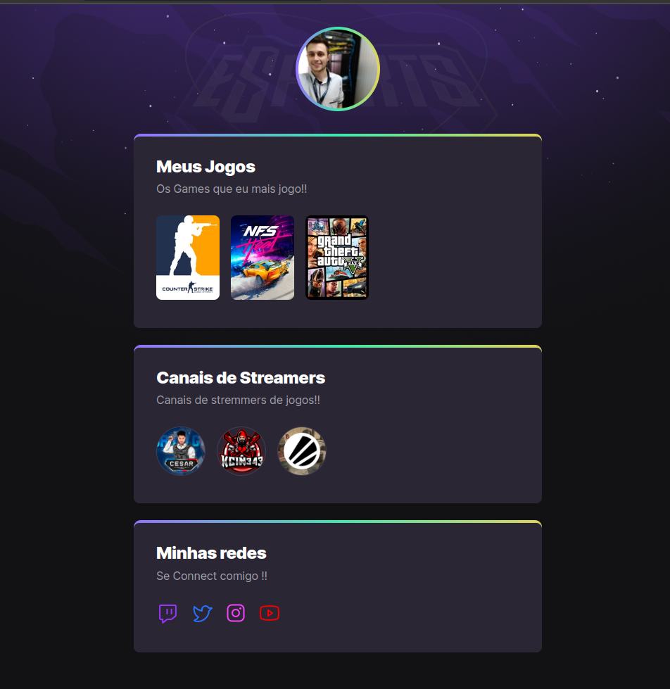

<h1 align="center">NLW Explorer  </h1>

<h3 align="center">
    🔗 HTML 🔗 CSS 
</h3>

<h3 align="center">
    🔗 Create page Css e HTML 
</h3>

🚀 Page for course

<h4 align="center"> 
	🚧 NLW EXPLORER 12 9 2022 🚀 Done...  🚧
	Acess link: https://pedroeduardo68.github.io/nlw_eSports_exporer
</h4>

<h2 align="center"> ### Exemple Page  </h2>

  

